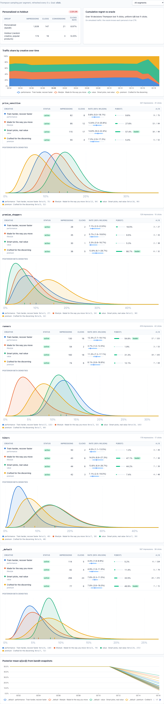
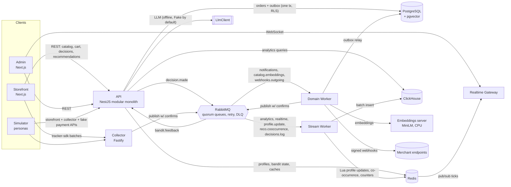
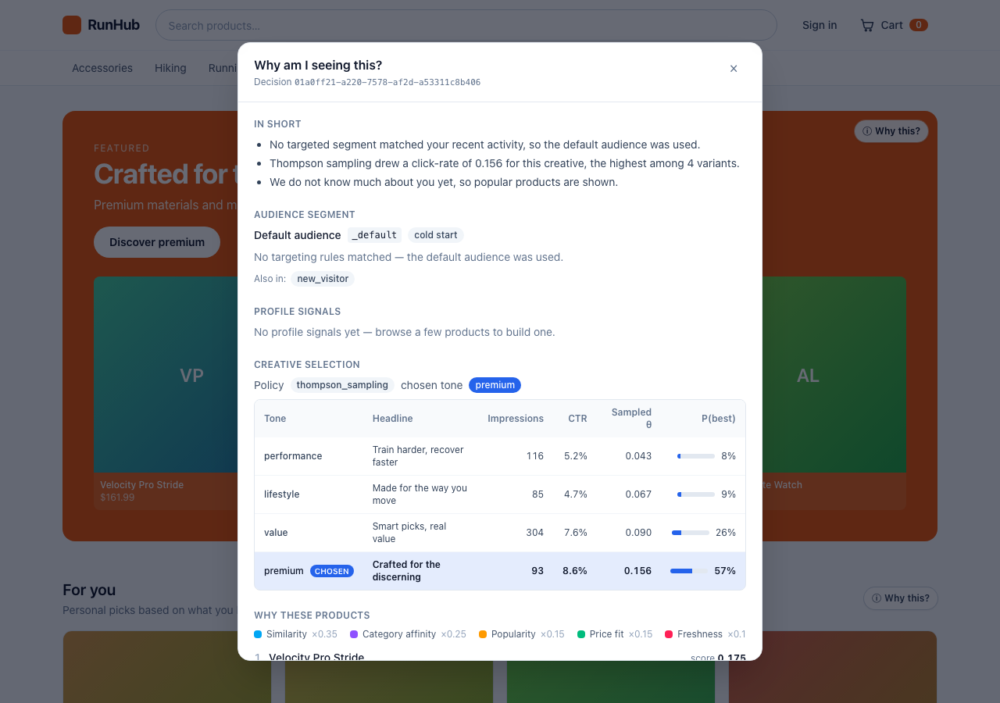
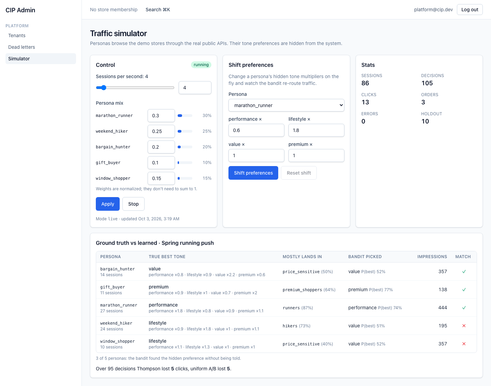
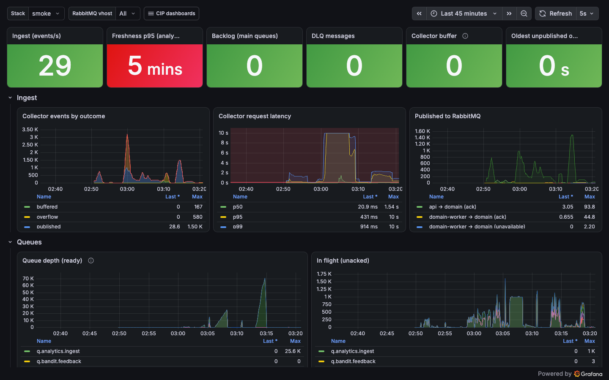
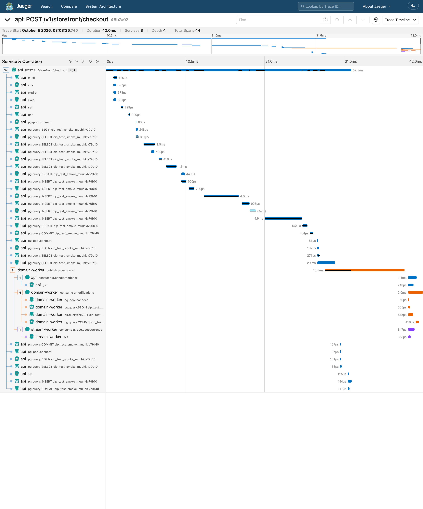

# Commerce Intelligence Platform

A multi-tenant commerce platform with a reliable event pipeline, real-time analytics and a self-learning
personalization engine. It is a TypeScript monorepo with 9 apps and 8 shared packages: a storefront, a
merchant admin, an API, an ingestion collector, three workers, a realtime gateway, a traffic simulator and
a small local embeddings server.



> **Status:** milestones **M0–M7** are implemented and verified locally (see [Testing](#testing) and
> [Performance](#performance)). Everything runs on one laptop: there is no public demo deployment, no video
> and no CI by design of this build. All personalization numbers are **on simulated traffic**.

## Highlights

- **Tenant isolation enforced by PostgreSQL Row-Level Security**, not only by application code: `FORCE RLS` on all
  29 tenant tables, a non-bypass role for the API, `SET LOCAL` per transaction. A query without tenant context fails.
  Measured cost against a non-RLS copy: **≈ 0.05 ms per transaction and +3–11% at the endpoint p50** (after fixing
  per-row `current_setting()` calls that had made list endpoints 26–43% slower).
- **No overselling**: atomic stock reservation in a fixed lock order, proven by a 100-concurrent-checkout test;
  200 concurrent k6 buyers on a pool of 20 products place **320 orders/s with 0** `5xx`, and with the seeded stock
  they sell exactly the 2,517 units available.
- **No lost events**: transactional outbox → RabbitMQ with publisher confirms, TTL retry queues, DLQ and replay.
  Chaos runs that kill the stream worker, stop RabbitMQ for 60 s or freeze ClickHouse for 120 s lost nothing.
- **Real-time analytics**: ClickHouse + Redis; events reach the dashboard with p95 freshness of **< 0.5 s at 3,000 events/s** (1.9 s at
  5,900 events/s); the collector keeps p95 < 100 ms up to ~17,700 events/s offered.
- **LLM proposes, humans approve, bandits decide**: generated creatives pass deterministic guardrails (real prices and
  discounts, banned claims, profanity, near-duplicates, language, prompt injection) and a review queue; Thompson
  sampling picks a creative per segment. In a 10-minute simulation the bandit found the hidden best tone for
  **4 of 4** main personas and lost **35% fewer clicks** than a uniform A/B test.
- **Explainable decisions**: every ad and recommendation stores the segment rules it matched, the profile signals,
  the sampled Beta values and per-feature contributions. "Why this?" shows them on the storefront.
- **End-to-end tracing across the message queue** with OpenTelemetry: one trace covers `POST /checkout` → outbox relay
  → three consumers in two other services, with auto-instrumented Postgres and Redis spans.
- **Measured**: k6 load tests, five chaos experiments, a CPU-profiled bottleneck fix with before/after numbers, an RLS
  overhead benchmark with confidence intervals, and Lighthouse + axe on 8 storefront/admin pages (0 axe violations,
  storefront LCP ≤ 2.22 s and CLS 0 on simulated mobile).

## Architecture



The API is a modular monolith ([ADR 0001](docs/adr/0001-modular-monolith.md)). Checkout writes the order and its
outbox event in one transaction; the domain worker relays the outbox. Tracking events go through the collector to
RabbitMQ; the stream worker writes them to ClickHouse in batches, updates live counters and maintains customer
profiles in Redis with an atomic Lua script. The personalization engine lives in the API: it reads the profile,
evaluates segment rules, generates and ranks product candidates, samples the bandit and logs every decision with its
explanation back through RabbitMQ to ClickHouse.

## How personalization works

1. **Profiles** (`profile:{tenant}:{id}` in Redis): category/brand/tone affinities with exponential decay
   (half-life 7 days) updated by a Lua script per batch of events; the update is commutative with respect to
   `occurred_at`, so consumers can scale without partitioning ([ADR 0012](docs/adr/0012-decayed-profile-commutative-updates.md)).
   Intent score from the last 30 minutes, price band from ClickHouse quantiles, identity stitching on login,
   snapshots of changed profiles to Postgres every 10 minutes.
2. **Segments**: JSON rules (`all`/`any`, 10 operators) validated with zod and compiled to predicates; six system
   segments per store; the bandit uses the matching target segment with the lowest priority
   ([ADR 0015](docs/adr/0015-primary-segment-by-priority.md)).
3. **Recommendations**: candidates from popular-by-affinity lists, pgvector kNN over the profile vector or the
   current product, co-occurrence and the campaign selector; a transparent linear score
   (0.35 similarity, 0.25 affinity, 0.15 popularity, 0.15 price fit, 0.10 freshness), filters, a cap of two items
   per brand and MMR (λ = 0.7). Contributions are stored with every result.
4. **Creatives**: an LLM generates variants offline from aggregates only; untrusted product text sits in a delimited
   block; guardrails flag or reject; a human with `marketing:approve` decides
   ([ADR 0013](docs/adr/0013-llm-outside-hot-path.md)).
5. **Thompson sampling** per (campaign, segment) with an own seeded PRNG and Marsaglia–Tsang Beta sampler,
   50-impression warm-up, impression dedupe by `decision_id`, optional discount factor γ, 10% holdout and last-click
   24 h attribution for conversion goals ([ADR 0014](docs/adr/0014-thompson-sampling-per-segment.md)).



## Tech stack

| Layer           | Technology                                                                 | Why                                                                        |
| --------------- | -------------------------------------------------------------------------- | -------------------------------------------------------------------------- |
| Monorepo        | pnpm workspaces, Turborepo, TypeScript (strict)                            | Shared contracts and packages, cached builds                               |
| API             | NestJS 11, Drizzle ORM, zod 4                                              | Modules and DI; SQL-first ORM that works with `SET LOCAL` and RLS          |
| Ingestion       | Fastify 5                                                                  | Many small JSON requests                                                   |
| Database        | PostgreSQL 16 + RLS, `pgvector` (HNSW), `ltree`, `pg_trgm`, `citext`       | Transactions, isolation, vector search filtered by tenant in one query     |
| Broker          | RabbitMQ 4 (quorum queues), amqplib                                        | Routing, per-message ack, TTL retries, DLQ                                 |
| Analytics       | ClickHouse                                                                 | Columnar scans, materialized views, `windowFunnel`, decisions log          |
| State           | Redis (ioredis, Lua)                                                       | Profiles, bandit arms, idempotency, dedupe, counters, caches               |
| Personalization | `@cip/personalization` (pure TS): decay, rules, ranking, MMR, Beta, Wilson | Isomorphic: used by the API, workers, admin charts and tests               |
| LLM             | Anthropic Messages API and OpenAI-compatible adapters, `FakeLlmClient`     | Structured JSON output; Fake runs everything offline and deterministically |
| Embeddings      | hash (tests), local all-MiniLM-L6-v2 over HTTP, OpenAI, Voyage — 384 dims  | Configurable provider, `pnpm reembed` with `embedding_version`             |
| Feature flags   | `@ashamrai/flags-node` (sibling project 02), offline fallback              | "AI creatives" per store behind a flag                                     |
| Frontend        | Next.js 15, React 19, TanStack Query, Tailwind CSS, ECharts                | ISR storefront with client-side personal blocks, interactive admin         |
| Observability   | pino, prom-client, OpenTelemetry → Jaeger, Prometheus, Grafana             | Logs, RED + business metrics, 4 dashboards, 11 alerts, traces via queues   |
| Testing         | Vitest, fast-check, Playwright, k6                                         | Unit, property, integration on real services, E2E, load                    |

## Run locally

Requirements: Node.js 22+, pnpm 10 and local PostgreSQL 16 (with `pgvector`), Redis, RabbitMQ (management plugin),
ClickHouse, MinIO and Mailpit on their default ports.

```bash
pnpm install && pnpm build
pnpm infra:setup         # migrations + roles/RLS, MinIO bucket, RabbitMQ topology, ClickHouse migrations
pnpm seed -- --reset     # RunHub and HomeBrew, staff, customers, promo codes, embeddings, demo segments and a live campaign
pnpm dev                 # every app in watch mode
```

Optional pieces: `node apps/embeddings-server/dist/main.js` + `EMBEDDINGS_PROVIDER=local pnpm reembed` (local MiniLM,
450 products in 3.8 s, ~200 MB RSS), `make backfill` (90 days of history), `make simulate` (10 minutes of persona
traffic), `scripts/observability.sh start` (Prometheus 4191, Grafana 4192, Jaeger 4193, RabbitMQ and datastore
exporters 4197/4196), `pnpm eval:creatives`, `pnpm demo:reset -- --yes` (nightly demo reset: recreate ClickHouse, vhost,
Redis keys, Postgres seed and a 90-day backfill), `pnpm bench:rls` (RLS overhead benchmark),
`pnpm quality:audit` (Lighthouse + axe against the smoke stack).
`pnpm smoke` runs every service from production builds on throwaway resources (ports 4180–4187), checks 59 flows
end to end and tears everything down. `docker-compose.yml` and `infra/docker/*` are written but were not run (no Docker
on the build machine); `infra/terraform/aws` validates with OpenTofu and was never applied.

| Service                                | URL                                                           |
| -------------------------------------- | ------------------------------------------------------------- |
| API (`/docs`, `/openapi.json`)         | http://127.0.0.1:4100                                         |
| Storefront (`?demo=1` for “Why this?”) | http://runhub.localhost:4130 · http://homebrew.localhost:4130 |
| Admin                                  | http://127.0.0.1:4140                                         |
| Collector / realtime gateway           | http://127.0.0.1:4110 · ws://127.0.0.1:4120/ws                |
| Workers / simulator metrics            | :4150 · :4151 · :4160                                         |

Demo logins (password `demo1234`): `owner@runhub.dev`, `marketer@runhub.dev` (campaigns and approvals),
`catalog@runhub.dev`, `support@runhub.dev`, `owner@homebrew.dev`, `demo@cip.dev` (two stores),
`platform@cip.dev` (tenants, DLQ, simulator), storefront customer `customer@runhub.dev`. Promo codes `WELCOME10`,
`TRAIL20`, `BREW15`; card `4242 4242 4242 4242` succeeds.

## Testing

| Level       | Command                                            | Result (this build)                                                                                           |
| ----------- | -------------------------------------------------- | ------------------------------------------------------------------------------------------------------------- |
| Static      | `pnpm lint`, `pnpm typecheck`, `pnpm format:check` | ESLint (incl. a no-comments rule) clean, dependency-cruiser: 0 violations, 23 typecheck tasks                 |
| Unit        | `pnpm test`                                        | 227 tests in 16 packages                                                                                      |
| Integration | `pnpm test:integration`                            | 117 tests on real Postgres, Redis, RabbitMQ, ClickHouse, MinIO, Mailpit (throwaway db/vhost/prefix)           |
| E2E         | `pnpm test:e2e`                                    | 7 Playwright scenarios on production builds                                                                   |
| Smoke       | `pnpm smoke`                                       | 59 checks across M0–M7                                                                                        |
| Quality     | `pnpm quality:audit`                               | Lighthouse 13 (mobile + desktop, median of 3) and axe (WCAG 2.2 AA + best practices) on 8 pages: 0 violations |
| Eval        | `pnpm eval:creatives`                              | 20 fixtures → 60 variants: 83.3% approvable, 20% flagged, 3.3% near-duplicates, 0 invalid outputs (Fake LLM)  |

Invariants and the tests that prove them:

| Invariant                                                                                                            | Test                                                                           |
| -------------------------------------------------------------------------------------------------------------------- | ------------------------------------------------------------------------------ |
| A tenant never sees another tenant's rows (all tenant tables, missing context fails)                                 | `apps/api/test/integration/tenant-isolation.test.ts`                           |
| pgvector kNN never returns another tenant's product, even with identical embeddings                                  | `apps/api/test/integration/personalization.test.ts`                            |
| 100 concurrent checkouts on stock 10 → exactly 10 orders; reverse-ordered carts do not deadlock                      | `apps/api/test/integration/checkout.test.ts`                                   |
| One `Idempotency-Key` → one order (parallel, different body → 422, Redis key lost)                                   | `apps/api/test/integration/checkout.test.ts`                                   |
| No domain event is lost while RabbitMQ is down                                                                       | `apps/api/test/integration/outbox-durability.test.ts`                          |
| A tracking event sent 3 times → 1 row; duplicates that slip past Redis do not inflate per-minute/product aggregates  | `apps/stream-worker/test/integration/*.test.ts`                                |
| **No AI creative is shown without human approval** (property test over random status sets)                           | `apps/api/test/integration/campaigns.test.ts`                                  |
| Every decision is explainable (segment rules, signals, arms, contributions stored and served)                        | `campaigns.test.ts`, `e2e/personalization.e2e.ts`                              |
| Profile updates are commutative, deduplicated per event and stitched on login                                        | `packages/personalization/test/unit/engine.test.ts`, `personalization.test.ts` |
| Beta sampler mean/variance on 100k samples; Wilson and P(best) properties; bandit convergence                        | `packages/personalization/test/unit/math.test.ts`                              |
| Guardrails catch fake prices/discounts, banned claims and injected instructions; approval is blocked                 | `apps/api/test/unit/campaigns.test.ts`, `campaigns.test.ts`                    |
| Webhooks are signed, retried with backoff, disabled after the last attempt and can be resent                         | `apps/api/test/integration/operations.test.ts`                                 |
| Refresh-token reuse revokes the whole family                                                                         | `apps/api/test/integration/auth.test.ts`                                       |
| A fake payment webhook pending during an API crash (`kill -9` inside the 2 s window) is still delivered exactly once | `apps/api/test/integration/fake-payment-restart.test.ts`                       |

E2E scenarios: guest checkout to `paid`; a merchant creates a product that appears on the storefront; the live
dashboard shows events in < 5 s; tenant isolation in the UI; **marketer: campaign → generate with the Fake LLM →
approve → block appears on the storefront → click → the experiment counter grows**; customer profile and segment
builder; simulator control with the ground-truth table.

## Performance

Environment: Apple M1 (8 cores, 8 GB RAM), macOS, Node 26.7, k6 2.3, every service, database, broker **and the load
generator** of this project on the same laptop; production builds, no OTLP export. Measured 2026-10-05 01:34–01:53 UTC
on a quiet machine: load average 2.9–4.8 before each run (mostly this project's own idle stack), up to 8.0 during the
heaviest ramp. JSON summaries: `docs/assets/k6/2026-10-05/` (the 2026-10-03 run under unrelated load — average 15–46 —
is kept in `docs/assets/k6/`).

| Scenario (k6)                            | Load                                                                   | p50                | p95                  | p99              | Errors / notes                                                                         |
| ---------------------------------------- | ---------------------------------------------------------------------- | ------------------ | -------------------- | ---------------- | -------------------------------------------------------------------------------------- |
| Collector ingest (`collector-ramp`)      | ramp 200 → 10,000 events/s (batches of 20), 6,080 events/s average     | 2.8 ms             | 6.2 ms               | 10.2 ms          | 0% errors, p95 < 100 ms held to the end of the ramp                                    |
| Collector ingest, ramp to failure        | ramp to 30,000 events/s; p95 crossed 100 ms at ~17,700 events/s target | 4.4 ms             | 159 ms               | 423 ms           | 0% errors; 8,825 events/s average over the run                                         |
| End-to-end freshness (`pipeline-e2e`)    | 800 / 3,000 events/s for 60 s                                          | 0.22 s             | 0.47 s               | 0.49 s           | 0 lost (same at both rates; the histogram's first bucket is 0.5 s)                     |
| End-to-end freshness, heavier            | 5,934 events/s for 60 s                                                | 0.24 s             | 1.87 s               | 3.83 s           | 0 lost; p95 < 2 s still met                                                            |
| Decision API (`decision-api`)            | 100 req/s, 2,000 profiles (30% warmed)                                 | 3.9 ms             | 6.1 ms               | 7.4 ms           | 0% errors                                                                              |
| Decision API, higher rates               | 371 req/s / 729 req/s achieved                                         | 1.9 / 1.5 ms       | 24.7 / 4.2 ms        | 238 / 316 ms     | 0% / 0.06% errors; p95 < 50 ms met at both                                             |
| Decision API, server side                | 10-minute simulation, 10,754 decisions (2026-10-03)                    | ≈ 7 ms             | ≈ 33 ms              | —                | 97.3% under 50 ms (`decision_latency_seconds`)                                         |
| Storefront API mix (`storefront-browse`) | 50 / 300 / 978 req/s                                                   | 7.1 / 3.6 / 1.8 ms | 15.3 / 9.1 / 21.3 ms | 19 / 13 / 875 ms | 0% errors; p95 < 200 ms at ≈ 1,000 req/s (VU pool saturated: 1,289 dropped iterations) |
| Checkout contention                      | 200 VUs, 20 products, 60 s, stock raised so it never runs out          | 466 ms             | 582 ms               | 806 ms           | **19,335 orders (320/s)**, 936 idempotent replays, **0 × 5xx**, no deadlocks           |

Checkout latencies are for the whole checkout (reservation in lock order, order, payment intent, outbox). With the
seeded stock (2,517 units in the pool) the same scenario sells out in seconds: exactly 2,517 orders, `reserved ≤ on_hand`
everywhere, 130 × 409 at checkout, and then cart adds return 409/429 (`checkout-contention-stock-bounded.json`).

**RLS overhead** (`pnpm bench:rls`, `docs/assets/rls-bench.md`): the same ten repository queries and eight API
endpoints against a byte-identical copy of the database with RLS disabled (and explicit `tenant_id` filters),
interleaved in random order, 2,000 SQL / 600 HTTP iterations per case, 95% bootstrap confidence intervals. The first run
showed list endpoints **26–43% slower** with RLS because the policies called `current_setting()` per row inside every
correlated subquery; wrapping it in a scalar subquery (evaluated once per statement, still usable for index scans)
fixed that, and the plans also exposed a hashed `EXISTS` that scanned every tenant's inventory (28.5 → 0.97 ms).
Final numbers: statements +2–9% for point lookups (−22% … +5% for lists, where the policy's tenant predicate often
gives a better plan), ≈ 0.05 ms per transaction for the extra `set_config` round trip, and **+3% to +11% at the
endpoint p50** (search suggest −8%).

**Frontend** (`pnpm quality:audit`, `docs/assets/quality/summary.md`, Lighthouse 13 median of 3 runs, simulated slow-4G
mobile and desktop presets, against `next start`): storefront home / category / PDP / cart / checkout have Performance
99–100, Accessibility 100, **LCP 1.05–2.22 s on mobile (0.27–0.62 s desktop) and CLS 0.000** (budget 2.5 s / 0.1); admin
dashboard / orders / products score 99–100 with LCP ≤ 0.92 s mobile. axe (WCAG 2.0–2.2 A/AA + best practices, admin in
light and dark mode) reports **0 violations** on all 8 pages after fixing low-contrast text (slate-400/500 on white
and dark surfaces, white text on the orange RunHub brand — now darkened per store to ≥ 4.6:1 automatically),
unlabelled table headers and the cart link's accessible name; CLS on home (0.19), cart (0.15) and checkout (0.10) was
removed by rendering the hero fallback with the campaign layout, full-size recommendation skeletons and a reserved
main-area height.

**Bottleneck investigation — decision API.** A `node --cpu-prof` profile of the API under the decision load showed
~19% of CPU in the Beta sampler (`sampleGamma`, the PRNG and `standardNormal`) because every decision recomputed
P(best) for its explanation with 1,000 Monte Carlo samples, and 8.5% in `cosine` (norms recomputed for vectors that are
already unit length). Fix: P(best) is cached per (campaign, segment) for 5 s (2,000 samples) and ranking uses a dot
product on unit vectors. Same k6 run before → after: **API CPU for ~6.4k requests 33.7 s → 17.4 s (−48%)**,
p50 16.7 → 4.9 ms, p95 945 → 135 ms. Profiles: `docs/assets/bottleneck-decision-api.txt`.

**Personalization on simulated traffic** (10 minutes, 15 sessions/s requested → 14.8/s achieved, 8,958 sessions):

| Persona         | Hidden best tone | Segment it mostly lands in | Bandit's choice (P(best)) | Correct |
| --------------- | ---------------- | -------------------------- | ------------------------- | ------- |
| marathon_runner | performance      | runners (85%)              | performance (0.94)        | ✓       |
| weekend_hiker   | lifestyle        | hikers (65%)               | lifestyle (0.87)          | ✓       |
| bargain_hunter  | value            | price_sensitive (86%)      | value (0.99)              | ✓       |
| gift_buyer      | premium          | premium_shoppers (59%)     | premium (0.92)            | ✓       |
| window_shopper¹ | lifestyle        | runners (60%)              | performance (0.94)        | ✗       |

¹ Not a main persona: it lands in the segment dominated by marathon runners, so it gets their best tone — the
known cost of segment-level (not individual) bandits. Cumulative expected regret against an oracle that knows the true
CTRs: **Thompson 397 clicks vs a uniform A/B shadow policy 607 clicks** over 9,770 decisions. The 10% holdout
(random creative + bestsellers) is tracked separately.



## Resilience

Chaos scripts in `infra/chaos` run against a local production-mode stack while k6 generates load; results are
appended to `infra/chaos/results.md`.

| Scenario                                                        | Expectation                                                                   | Observed                                                                                                                                                                                                    | Result |
| --------------------------------------------------------------- | ----------------------------------------------------------------------------- | ----------------------------------------------------------------------------------------------------------------------------------------------------------------------------------------------------------- | ------ |
| `kill -9` stream worker during 500 events/s, restart after 10 s | No loss, no duplicates in analytics                                           | 29,780 sent = 29,780 rows (`FINAL`) = 29,780 unique ids, DLQ 0                                                                                                                                              | PASS   |
| RabbitMQ stopped 60 s                                           | Collector buffers then 503; orders still created; all domain events delivered | 10/10 orders created and delivered, outbox drained (lag peak 57 s), buffer peak 10,000, 1,639 × 503, 18,620 accepted = stored; 118 batches given up by the client after 6 retries (documented bounded loss) | PASS   |
| ClickHouse frozen 120 s (`SIGSTOP`)                             | Retries accumulate, then drain; DLQ empty                                     | backlog peak 23,118 → 0, 32,000 sent = 32,000 stored, DLQ 0                                                                                                                                                 | PASS   |
| Redis keys deleted under decision load                          | Decision API keeps answering; idempotency still holds                         | 734,877 keys deleted, 901 decisions, 0 errors; checkout replay → still exactly 1 order                                                                                                                      | PASS   |
| Slow consumer (200 ms per message)                              | Lag grows, alert fires, drains after restore                                  | `q.realtime.counters` peak 68,691; Grafana and Prometheus backlog alerts fired; 0 after restore                                                                                                             | PASS   |



## Observability

Prometheus scrapes every service; Grafana loads four dashboards as code (System overview, Event pipeline, Business,
Personalization) and 11 alert rules (DLQ > 0, freshness p95 > 10 s, outbox lag > 1 min, backlog growth, 5xx > 1%,
decision p95 > 50 ms, event-loop lag, checkout failures …); `node scripts/verify-observability.mjs` checks them
through the Grafana HTTP API. A small datastore exporter adds Postgres (`pg_stat_database`, connections, lock waits),
Redis (`INFO`) and ClickHouse (`system.metrics`/`events`, rows per table) metrics to a "Datastores" row. Traces go to
Jaeger over OTLP; `pg` and `ioredis` are auto-instrumented (ESM hooks via `import-in-the-middle`, spans only inside a
traced operation) and `traceparent` travels through outbox rows and RabbitMQ headers, so one checkout trace (44 spans:
30 Postgres, 9 Redis) spans the API, the outbox relay in the domain worker and three consumers:



## Architecture decisions

| ADR                                                          | Decision                                                                              |
| ------------------------------------------------------------ | ------------------------------------------------------------------------------------- |
| [0001](docs/adr/0001-modular-monolith.md)                    | Modular monolith for domain logic; separate services only for different load profiles |
| [0002](docs/adr/0002-shared-schema-rls.md)                   | Shared schema + `tenant_id` + PostgreSQL RLS                                          |
| [0003](docs/adr/0003-drizzle-orm.md)                         | Drizzle ORM with SQL-first migrations                                                 |
| [0004](docs/adr/0004-transactional-outbox.md)                | Transactional outbox, SKIP LOCKED relay, LISTEN/NOTIFY                                |
| [0005](docs/adr/0005-at-least-once-idempotent-consumers.md)  | At-least-once delivery with idempotent consumers                                      |
| [0006](docs/adr/0006-retry-ttl-queues-dlx.md)                | Retries via TTL queues and a dead-letter exchange                                     |
| [0007](docs/adr/0007-rabbitmq-not-kafka.md)                  | RabbitMQ rather than Kafka                                                            |
| [0008](docs/adr/0008-clickhouse-analytics.md)                | ClickHouse for analytics                                                              |
| [0009](docs/adr/0009-two-level-event-dedupe.md)              | Two-level event dedupe: Redis + ReplacingMergeTree                                    |
| [0010](docs/adr/0010-manual-batching.md)                     | Manual batching in the stream worker, ack after insert                                |
| [0011](docs/adr/0011-pgvector-in-main-database.md)           | pgvector in the main database                                                         |
| [0012](docs/adr/0012-decayed-profile-commutative-updates.md) | Profiles with exponential decay and commutative updates                               |
| [0013](docs/adr/0013-llm-outside-hot-path.md)                | LLM outside the hot path: offline generation + human approval                         |
| [0014](docs/adr/0014-thompson-sampling-per-segment.md)       | Thompson sampling per segment                                                         |
| [0015](docs/adr/0015-primary-segment-by-priority.md)         | Primary segment by priority for the bandit partition                                  |
| [0016](docs/adr/0016-template-explanations.md)               | Explanations from templates of real features, not from an LLM                         |
| [0017](docs/adr/0017-personal-blocks-outside-page-cache.md)  | Personal blocks outside the cached page                                               |
| [0018](docs/adr/0018-ws-and-redis-pubsub-gateway.md)         | `ws` + Redis pub/sub for the realtime gateway                                         |
| [0019](docs/adr/0019-zod-contracts-openapi.md)               | zod contracts → OpenAPI → typed client                                                |
| [0020](docs/adr/0020-idempotency-redis-and-unique-index.md)  | Checkout idempotency: Redis key + unique index                                        |
| [0021](docs/adr/0021-lock-ordering-reservations.md)          | Conditional stock reservations in a fixed lock order                                  |

## Known limitations & next steps

- **Outbox relay** is one process publishing batches of 100; at many tenants it would become the bottleneck
  (next: partitioning or CDC with Debezium).
- **Ranking uses hand-set weights**, not a trained model; real data would call for learning-to-rank with offline
  evaluation (NDCG). The intent score coefficients are a heuristic (a logistic regression on sessions → conversion
  would replace them).
- **The bandit is not contextual inside a segment** (segment = context), so minority personas inherit the majority's
  best tone (see the window_shopper row). Next: LinUCB or contextual Thompson on profile features.
- **Delayed feedback**: conversions can arrive up to 24 h after the impression, which biases conversion-goal
  estimates during the first day.
- **All personalization metrics come from simulated traffic.**
- **One region, one Postgres instance.** RLS is cheap but not free: ≈ 0.05 ms per transaction for the extra
  `set_config` round trip and +3–11% per endpoint (see Performance); it also makes plan quality depend on the policy
  shape, so new policies must keep the `(SELECT current_setting(…))` form.
- **Postgres full-text search** does not replace a search engine above ~100k SKUs.
- **Load numbers come from one laptop** that also runs the load generator; the collector holds p95 < 100 ms up to
  ~17,700 events/s offered, and the stream worker then needs about a minute to drain the backlog, so sustained ingest
  above ~6,000 events/s would need more consumers. The per-event publish with confirms into quorum queues is the next
  thing to profile on dedicated hardware.
- **Price EWMA in profiles is order-dependent** (α = 0.2), unlike the decayed affinities.
- **Payments and LLMs are simulated by default**: the Stripe, Anthropic, OpenAI-compatible, OpenAI and Voyage
  adapters are implemented and unit-tested with mocked HTTP but never called (no keys, local-only build).
- **No CI, demo deployment or video** in this build; all checks run locally. `pnpm demo:reset` exists for a nightly
  reset, but no host or cron job runs it.

## Non-goals

Taxes and multi-currency per store, real payments and PCI scope, multilingual content, marketplaces, theme builders,
email/SMS marketing, ML model training (heuristics, bandits and embeddings only), Kubernetes.
