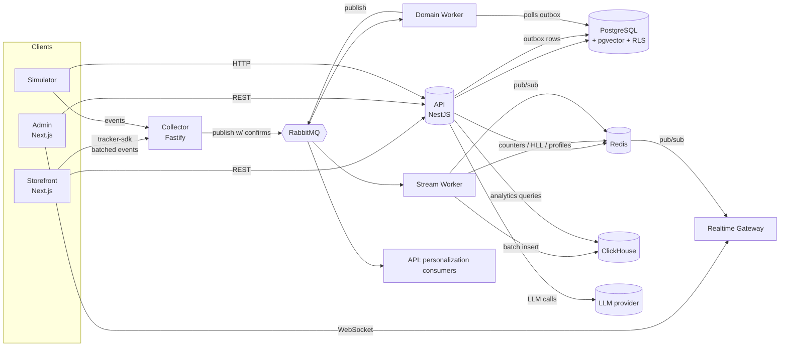

# 02 · Архитектура

## Общая схема



## Сервисы

| Сервис | Технология | Ответственность | Почему отдельный |
|---|---|---|---|
| `api` | NestJS 11, Drizzle ORM, zod | Вся бизнес-логика: tenancy, auth, catalog, inventory, cart, checkout, orders, customers, analytics-запросы, personalization, campaigns | Модульный монолит: модули с чёткими границами, общая транзакция там, где нужна |
| `collector` | Fastify 5 | Приём событий трекинга: валидация, обогащение, rate limit, публикация в RabbitMQ | Другой профиль нагрузки (много маленьких запросов), масштабируется независимо, не должен падать вместе с API |
| `stream-worker` | Node + amqplib | Потребляет события: batch insert в ClickHouse, realtime-счётчики, обновление профилей | CPU/IO-нагрузка изолирована от API |
| `domain-worker` | Node + amqplib | Outbox relay, email, истечение резервов, вебхуки мерчанта, пересчёт embeddings, CSV-импорт | Фоновые задачи с ретраями |
| `realtime-gateway` | Node + `ws` | Держит WebSocket-соединения админки, пушит метрики из Redis pub/sub | Stateful-соединения отдельно от stateless API |
| `storefront` | Next.js 15 (App Router) | Витрина: SSR/ISR, SEO, корзина, checkout | Публичная часть, кэш на CDN |
| `admin` | Next.js 15 | Дашборд мерчанта | Отдельный деплой, другая модель auth |
| `simulator` | Node | Генерация трафика по персонам | Только для демо/нагрузки |

> **Почему модульный монолит, а не микросервисы для domain-логики?** Checkout затрагивает cart, inventory, discounts, orders — в монолите это одна транзакция. Микросервисы тут означали бы сагу ради саги. Выделены только сервисы с **другим профилем нагрузки или жизненным циклом** (collector, workers, gateway). Это ADR-001 — важный вопрос на интервью.

## Модули NestJS (`apps/api/src/modules`)

```text
modules/
├── tenancy/          # тенанты, контекст тенанта, RLS-сессия
├── identity/         # users, memberships, auth, refresh tokens, invites
├── access/           # permissions, guards, API keys
├── audit/            # audit log (interceptor + сервис)
├── catalog/          # categories, products, variants, search, images
├── inventory/        # stock, reservations, movements
├── cart/
├── discounts/
├── checkout/         # оркестрация: cart → reservation → order → payment
├── payments/         # PaymentProvider, webhooks
├── orders/           # статусная машина, история, refunds
├── customers/        # покупатели, профиль (read-model)
├── analytics/        # запросы к ClickHouse, кэширование
├── personalization/  # профили, рекомендации, decision API
├── campaigns/        # кампании, креативы, LLM-генерация, approve
├── experiments/      # bandit state, статистика
├── outbox/           # запись событий в outbox в той же транзакции
└── simulator-control/# старт/стоп симулятора (только dev/demo)
```

Внутри модуля — слои:

```text
catalog/
├── domain/           # сущности, value objects, доменные ошибки — без Nest и без БД
├── application/      # use-cases (commands/queries), порты (интерфейсы репозиториев)
├── infrastructure/   # Drizzle-репозитории, внешние клиенты
└── http/             # controllers, DTO (zod), mapping
```

Правило зависимостей проверяется линтером (`eslint-plugin-boundaries` или `dependency-cruiser`): `domain` ни от чего не зависит, `http` не импортирует `infrastructure` напрямую, модули общаются через публичный `index.ts` модуля.

> Без фанатизма: CQRS как паттерн (разделение command/query use-cases), но **без** event sourcing и без `@nestjs/cqrs`, если он не нужен. На чтение для списков можно ходить в БД напрямую из query-хендлера (не через агрегаты).

## Ключевые потоки

### 1. Checkout (самый важный поток)

```mermaid
sequenceDiagram
  participant C as Customer (storefront)
  participant API
  participant PG as PostgreSQL
  participant R as Redis
  participant PP as PaymentProvider
  participant DW as Domain Worker
  participant MQ as RabbitMQ

  C->>API: POST /checkout (Idempotency-Key)
  API->>R: SET idem:{tenant}:{key} NX (lock, 60s)
  alt ключ уже есть и завершён
    API-->>C: сохранённый ответ (200)
  end
  API->>PG: BEGIN; SET LOCAL app.tenant_id
  API->>PG: пересчёт корзины, проверка скидки
  API->>PG: UPDATE inventory SET reserved+=q WHERE on_hand-reserved>=q (для каждой позиции)
  API->>PG: INSERT order, order_items, reservation
  API->>PG: INSERT outbox(order.placed)
  API->>PG: COMMIT
  API->>PP: createPaymentIntent(order)
  API-->>C: 201 {orderId, paymentClientSecret}
  API->>R: сохранить ответ по idem-ключу (24h)
  PP-->>API: webhook payment.succeeded (async)
  API->>PG: BEGIN; order→paid; reservation→committed; on_hand-=q; outbox(order.paid); COMMIT
  DW->>PG: SELECT outbox ... FOR UPDATE SKIP LOCKED
  DW->>MQ: publish (confirm)
  DW->>PG: mark published
```

Детали:
- Позиции блокируются **в порядке `variant_id`** — исключает deadlock при параллельных checkout с пересекающимися товарами.
- Если хотя бы одна позиция не зарезервировалась → ROLLBACK → `409 INSUFFICIENT_STOCK` с перечнем позиций.
- Idempotency: ключ в Redis + уникальный индекс `(tenant_id, idempotency_key)` в `orders` как вторая линия защиты (Redis может потерять ключ).
- Истечение резерва: `domain-worker` раз в 30 сек снимает просроченные резервы и переводит заказ в `cancelled` (`reason=payment_timeout`).

### 2. Событие трекинга

```text
browser (tracker-sdk)
  → batch до 20 событий / 5 сек / при visibilitychange (sendBeacon)
  → POST collector /v1/events  (заголовок X-Api-Key: pk_…)
      ├─ валидация zod по event_type + schema_version
      ├─ проверка ключа (кэш в памяти 60 сек, источник — Redis)
      ├─ rate limit на ключ + IP (Redis, sliding window)
      ├─ обогащение: received_at, country (по IP, geoip-lite), device по UA
      ├─ publish в exchange `track` (routing key = event_type), publisher confirms
      └─ 202 Accepted {accepted, rejected[]}
  → RabbitMQ
      ├─ q.analytics.ingest   → stream-worker → ClickHouse (batch 1000 / 1 сек)
      ├─ q.realtime.counters  → stream-worker → Redis INCR/PFADD → PUBLISH
      ├─ q.profile.update     → stream-worker → профиль в Redis
      └─ q.bandit.feedback    → api (personalization) → обновление alpha/beta
```

### 3. Показ персонализированного блока на витрине

```text
storefront (RSC) → GET /v1/storefront/decisions?placement=home_hero&profileId=…
  api:
   1. профиль из Redis (или пустой → сегмент "new_visitor")
   2. сегменты профиля (правила, в памяти)
   3. активные кампании для placement, подходящие по сегменту
   4. для каждой кампании: Thompson sampling по одобренным креативам (state в Redis)
   5. подбор товаров (кандидаты + ранжирование)
   6. decision_id + explanation → в ClickHouse (через MQ, асинхронно)
  ← {decisionId, creative, products[], explanation}
storefront рендерит блок, tracker отправляет ad_impression{decisionId}
клик → ad_clicked{decisionId} → bandit.feedback
покупка в течение 24h атрибутируется последнему клику (last-click) → ad_converted
```

Бюджет латентности decision API: **p95 < 50 мс** (всё из Redis и памяти, без LLM в hot path — LLM только офлайн при генерации креативов).

## Выбор технологий (кратко; подробно — в ADR)

| Задача | Выбор | Альтернативы | Почему |
|---|---|---|---|
| Монорепо | pnpm + Turborepo | Nx | Проще, достаточно для 8 приложений |
| API-фреймворк | NestJS | Express, Fastify | Модули, DI, guards — структура для большого домена |
| ORM | Drizzle | Prisma, TypeORM | Близко к SQL, нормально работает с RLS и `SET LOCAL`, типизация |
| Валидация | zod (общие схемы в `packages/contracts`) | class-validator | Одна схема для фронта, бэка и событий |
| Брокер | RabbitMQ (quorum queues) | Kafka, Redis Streams | Маршрутизация, ретраи/DLQ из коробки, разумно для этого объёма |
| Аналитика | ClickHouse | Postgres, TimescaleDB | Колоночное хранение, MV, `windowFunnel` для воронок |
| Кэш/счётчики | Redis 7 | — | HLL, атомарные счётчики, pub/sub, locks |
| Векторы | pgvector в основной БД | Qdrant, Pinecone | < 1 млн векторов, фильтр по tenant_id в том же запросе |
| Realtime | `ws` + Redis pub/sub | Socket.IO | Контроль протокола, меньше магии |
| Фронт | Next.js 15, TanStack Query, shadcn/ui, Recharts/ECharts | — | SSR для витрины, быстрый UI админки |
| Observability | OpenTelemetry → Tempo/Jaeger, Prometheus, Grafana, Loki | — | Трейсинг через очередь — главная фишка |

## Конфигурация и окружения

- Конфиг через env, валидация zod при старте (падаем сразу, если нет переменной).
- Окружения: `local` (compose), `ci`, `demo` (VPS).
- Feature flags для экспериментальных фич — **через проект 02** (feature-flags-platform), когда он будет готов. Это связывает портфолио.

## Масштабирование (что написать в README, даже если не делаешь)

- API и collector — stateless, горизонтально.
- stream-worker — несколько consumers на очередь; порядок событий одного пользователя не критичен (профиль коммутативен с decay по timestamp).
- realtime-gateway — несколько инстансов, fan-out через Redis pub/sub.
- Postgres — read replica для аналитических запросов админки не нужна (они в ClickHouse).
- Узкое место при росте — outbox relay (один поток) → решение: партиционирование по tenant_id или переход на CDC (Debezium). Записать в *Known limitations*.
